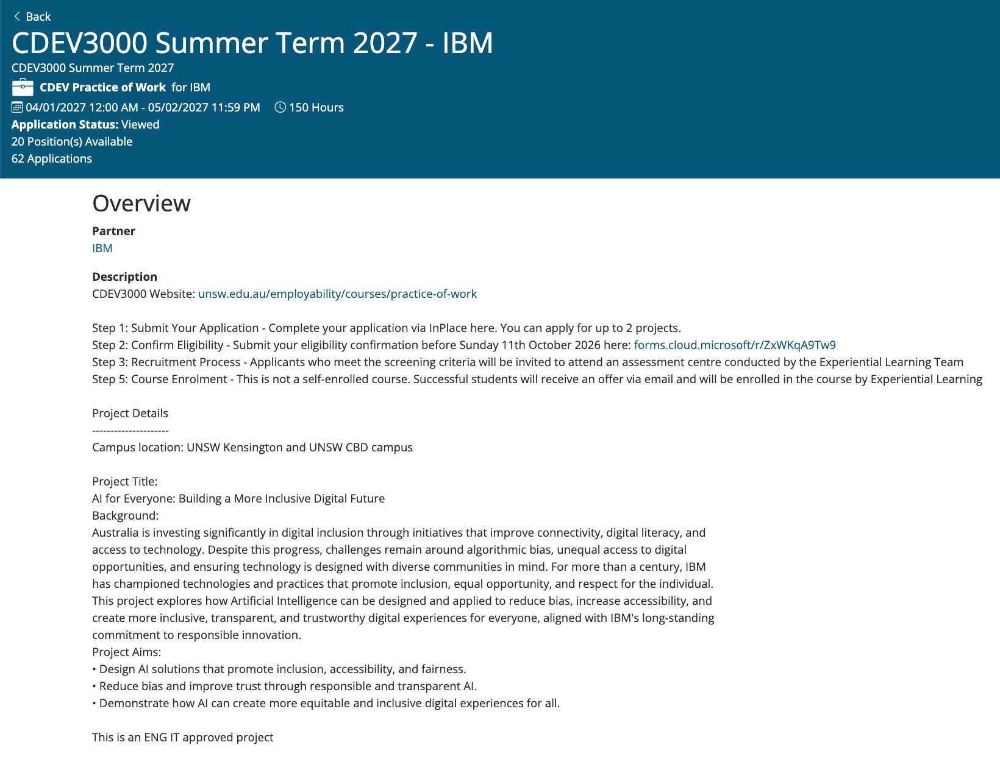
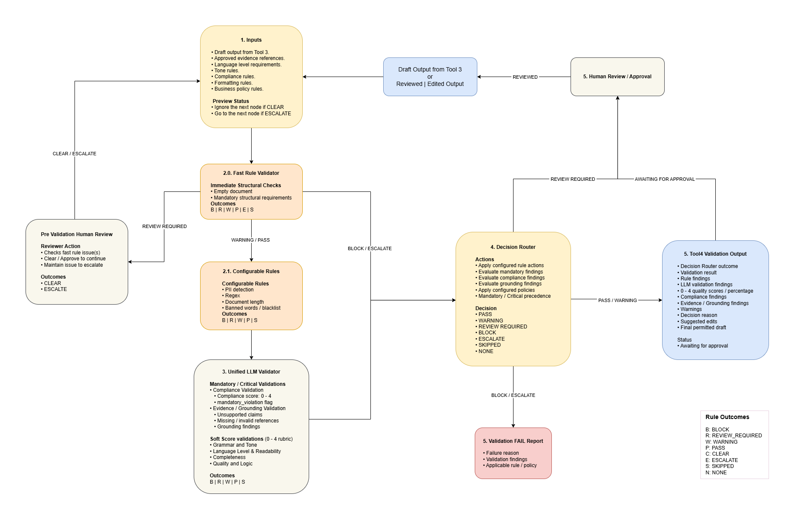

## IBM Project Architecture
```text
                   AI Generated Content
                            │
                            ▼
                 ┌─────────────────────┐
                 │ Evidence Validation │
                 └──────────┬──────────┘
                            │
             ┌──────────────┼──────────────┐
             ▼              ▼              ▼
     Rule Validation   LLM Validation   Security
             │              │              │
             └──────────────┼──────────────┘
                            ▼
                 ┌─────────────────────┐
                 │ Fairness / Bias     │
                 │ Evaluation          │
                 └──────────┬──────────┘
                            │
                            ▼
                 ┌─────────────────────┐
                 │ Accessibility /     │
                 │ Language Evaluation │
                 └──────────┬──────────┘
                            │
                            ▼
                 ┌─────────────────────┐
                 │ Explainable Result  │
                 └──────────┬──────────┘
                            │
                            ▼
                    Human Review
```
### IBM project requirement:
| IBM project requirement | Tool4 experience | Fit |
|---|---|---|
| Design AI solutions promoting inclusion/accessibility/fairness | Tool4 AI validation platform, configurable validation rules, language/CEFR checking, evidence validation | **Strong** |
| Reduce AI bias | LLM validation of language, evidence, compliance, quality; deterministic rules + LLM validation | **Strong foundation** |
| Responsible AI | Human-in-the-loop approval, evidence-based validation, configurable rules, decision routing | **Strong** |
| Transparent AI | Validation results, rule findings, LLM evaluation dimensions, structured JSON output | **Strong** |
| Trustworthy AI | Validation before approval, approved evidence references, business rules, regex/PII checks | **Strong** |
| AI model integration | Azure AI / Foundry, Prompt Flow, model connections, LLM workflows | **Strong** |
| AI workflow engineering | Python DAGs, Prompt Flow, Tool1/Tool4, routing and orchestration | **Very strong** |
| AI platform engineering | Azure ML environments, managed endpoints, deployments, ACR, Managed Identity/RBAC, IaC | **Very strong** |
| Accessibility / diverse communities | Tool4 CEFR/language validation work gives a relevant technical foundation, but not extensive direct accessibility research | **Moderate / developable** |
| Algorithmic-bias research | Tool4 have practical validation experience, but not deep academic/statistical bias modelling | **Moderate / developable** |
| Inclusive digital experiences | Tool4 validation platform can be positioned toward this, but direct UX/accessibility experience isn't Tool4 strongest area | **Moderate** |
| Responsible AI governance/frameworks | Tool4 have implemented practical controls, but formal AI governance frameworks are not a major part of Tool4 | **Moderate / developable** |




## Tool4 Architecture
```text
                      Input
                         │
                         ▼
                ┌──────────────────┐
                │ Evidence / Rules │
                └────────┬─────────┘
                         │
                         ▼
                ┌──────────────────┐
                │ Fast Rule        │
                │ Validation       │
                └────────┬─────────┘
                         │
             ┌───────────┼───────────┐
             ▼                       ▼
    Configurable Rules     Unified LLM Validation  
             │                       │
             └───────────┬───────────┘
                         │
                         ▼
                ┌──────────────────┐
                │ Decision Router  │
                └────────┬─────────┘
                         │
                         ▼
              Human Review / Approval
```
### Tool4 validation covers things such as:
- approved evidence
- evidence references
- compliance
- grammar
- language
- completeness
- quality
- CEFR
- banned words
- regex patterns
- PII-related detection
- minimum/maximum length
- business rules
- human approval


## Genuine gap
I would not tell IBM that Tool4 already have deep expertise in all aspects of algorithmic fairness.
There are some areas where Tool4 experience is adjacent rather than direct.
Algorithmic bias
For example, formal bias analysis could involve:
- demographic parity
- equal opportunity
- equalised odds
- disparate impact
- subgroup performance
- fairness metrics
- statistical significance
- bias evaluation datasets

## Accessibility is another area to strengthen
Tool4 current experience gives some relevant material through:
- CEFR
- language validation
- content quality
- inclusive language potential
- configurable validation rules
But accessibility engineering could also involve:
- WCAG
- ARIA
- screen readers
- keyboard navigation
- colour contrast
- alternative text
- cognitive accessibility
- assistive technologies

## Samples
- Tool4 LLM DAG
http://ai.home:8000/
- Google AI Studio LLM DAG
http://dev.home:8000/


